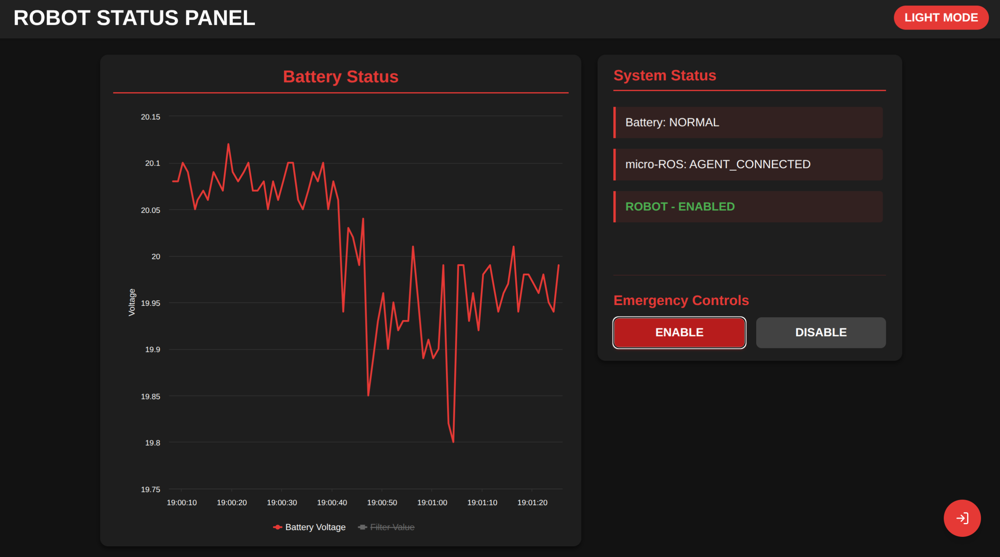

# ESP-Daemon

ESP-Daemon is a communication and control system for Eurobot robots, implemented using Seeed Studio XIAO ESP32C3 and ROS2. The system provides multiple features including SIMA communication (ESP-NOW Bridge), RGB strip control, wireless emergency stop, and BMS (Battery Management System) integration.



## Hardware Requirements

- **Main Controller**: Seeed Studio XIAO ESP32C3
  - 32-bit RISC-V @ 160MHz processor
  - 400KB SRAM, 4MB Flash
  - 2.4GHz WiFi and Bluetooth 5.0
  - USB Type-C interface

## Features

- **SIMA Communication**: Low-latency robot-to-robot communication using ESP-NOW protocol
- **RGB Strip Control**: Support for programmable RGB strips like WS2812B
- **Wireless Emergency Stop**: Remote emergency stop functionality
- **BMS Integration**: Battery Management System integration
- **ROS2 Integration**: Seamless integration with ROS2 ecosystem using micro-ROS
- **Docker Support**: Containerized deployment solution
- **Web Interface**: Built-in web UI for device configuration and monitoring

## System Requirements

- Ubuntu 20.04 or higher
- Docker and Docker Compose
- ROS2 Humble or higher
- PlatformIO IDE (for ESP32 firmware development)

## Quick Start

### 1. Clone the Repository

```bash
git clone https://github.com/DIT-ROBOTICS/ESP-Daemon.git
cd ESP-Daemon
```

### 2. Compile ESP32 Firmware

```bash
cd esp_firmware
pio run
```

### 3. Upload Firmware to XIAO ESP32C3

```bash
pio run -t upload
```

### 4. Access Web Interface

After uploading the firmware, the device will create a WiFi access point. Connect to it and navigate to:
```
http://192.168.4.1
```

### 5. Launch ROS2 Nodes

Start the services using Docker Compose:

```bash
docker compose up
```

## Configuration Guide

### ESP32 Configuration

1. Modify settings in `esp_firmware/platformio.ini`:
   - Update `upload_port` to your XIAO ESP32C3 device port (usually `/dev/ttyACM0`)
   - Adjust `monitor_speed` as needed (default: 115200)

2. Configure in `esp_firmware/include/config.h`:
   - WiFi settings
   - ESP-NOW peer addresses
   - RGB strip configuration
   - BMS parameters

### ROS2 Configuration

1. Environment Variables:
   ```bash
   export ROS_DOMAIN_ID=<same_as_esp_config>
   ```

2. Docker Configuration:
   - Set appropriate environment variables in `docker-compose.yaml`
   - Ensure proper device and directory mounting

## Usage Guide

### SIMA Communication

The system uses a numeric command system through the `/sima/start` topic:

1. Send commands using ROS2:
   ```bash
   # Format: ros2 topic pub /sima/start std_msgs/msg/Int16 "{data: <command>}"
   
   # Send command to all SIMA devices
   ros2 topic pub /sima/start std_msgs/msg/Int16 "{data: 5}"
   ```

2. Monitor system status:
   ```bash
   # Monitor battery voltage
   ros2 topic echo /robot_status/battery_voltage
   
   # Monitor device heartbeat
   ros2 topic echo /esp32_counter
   ```

### Emergency Stop

The emergency stop system uses a relay control through the `/robot_status/emergency_stop` topic:

1. Trigger emergency stop:
   ```bash
   # Enable emergency stop
   ros2 topic pub /robot_status/emergency_stop std_msgs/msg/Bool "{data: true}"
   
   # Disable emergency stop
   ros2 topic pub /robot_status/emergency_stop std_msgs/msg/Bool "{data: false}"
   ```

2. The system will:
   - Enable relay when emergency stop is triggered
   - Disable relay when emergency stop is released
   - Automatically handle mode transitions

### Battery Monitoring

The system continuously monitors battery voltage:

1. View real-time battery voltage:
   ```bash
   ros2 topic echo /robot_status/battery_voltage
   ```

2. The voltage is published as a Float32 value in the `/robot_status/battery_voltage` topic

### System States

The device operates in different modes:
- `WAITING_AGENT`: Initial state, waiting for ROS2 agent
- `AGENT_AVAILABLE`: ROS2 agent is available
- `AGENT_CONNECTED`: Successfully connected to ROS2 agent
- `AGENT_DISCONNECTED`: Lost connection to ROS2 agent

## Development Guide

### Adding New Features

1. ESP32 Firmware Development:
   - Add new features in `esp_firmware/src`
   - Update dependencies in `platformio.ini`

2. ROS2 Node Development:
   - Create new ROS2 packages in `esp_daemon_ws/src`
   - Update Docker configuration to include new packages
